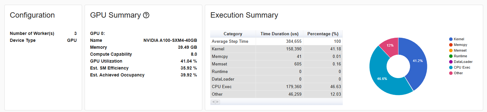
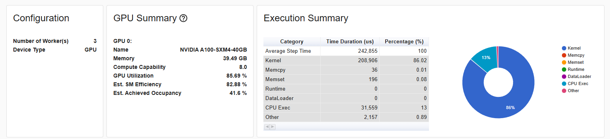
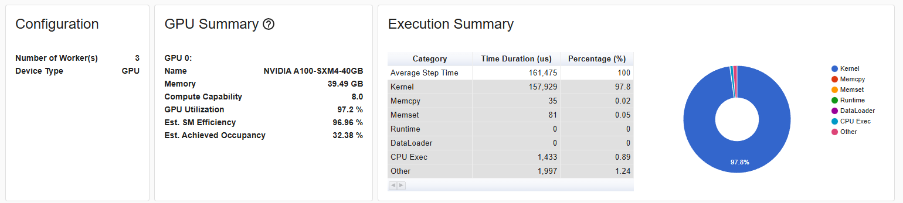

This is a complete adaptation of GPT-2 (with some GPT-3 hyperparameters) followed from Andrej Karpathy's YouTube lectures, "Neural Networks: Zero to Hero". 

Distributed training is set up such that one GPU or multiple can be used. (FSDP will be added on later).

The following are additions that have been done:

### Dropout and biases

The first obvious additions that will likely improve the model is by including dropout regularization and biases in the linear layers. 

### Between shard shuffling

I included between shard shuffling in the data loader because the dataset (fineweb-edu) is collected in parts from specific websites, such as Wikipedia and Arxiv. This collection resulted in the dataset having clear segments of where the data is from. For example, when sharding the data, the first two may only contain info from Wikipedia and the next 3 will be from Arxiv. Hence, when training on the first two shards, the loss will jump up when it switches to the Arxiv shards because it was only focusing on Wikipedia. So by shuffling the shards, the training loss becomes smoother.

### PyTorch Profiler

Profiled the model to compare underutilizing GPU resources versus maximally utilizing GPU resources with optimized kernel fusions. Specifically, three different runs were done on an A100: (1) an underutilization of GPU resources by reducing the batch size and sequence length (B=12, T=128) such that more gradient accumulations steps were required (the CPU was used more), (2) running on larger batches and sequence lengths (such as B=64, T=512), resulting in full use of the A100 resources, and (3) running torch.compile to fully utilize optimized fused kernels (B=64, T=512). All runs used autocast with bfloat16.  

### (1) Under-utilized A100

### (2) Fully-utilized A100

### (3) Optimized A100 using torch.compile

Training time (Time Duration) can clearly be seen that it decreases as more GPU resources are used. Specifically, using more optimized kernels where there are fused operations reduce the CPU overhead by having less memory movement from global memory to local memory. What is essentially happening is that fused operations (when torch.compile is activated) allow the CPU to launch a single kernel that performs multiple operations (combining multiple kernels into one) entirely on the GPU, rather than launching separate kernels that write intermediate results back to global memory before the next operation. Basically, reduce ping ponging back and forth from global memory because it is slow. 

### Fused bias + GELU 

Normally in a transformer MLP block, there is a 3 step process where there is a linear matmul, an added bias, and then a GELU activation. Each step usually calls three different kernels for each step, leading to 2-3 extra global memory read/writes. The custom kernel reduces the memory overhead by only requiring 2 kernel launches and saves 1 global write/read.  

Before kernel:
- y = x @ W
- z = y + b
- out = gelu(z)

After kernel:
- y = x @ W
- out = gelu(y + b)

### Addons in the process:
- FSDP training for educational purposes (the model isn't big enough to require multiple GPUs to be split)
- KV cache
- GQA/MQA
